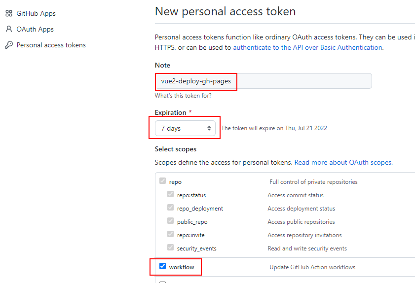
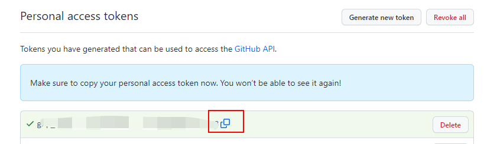
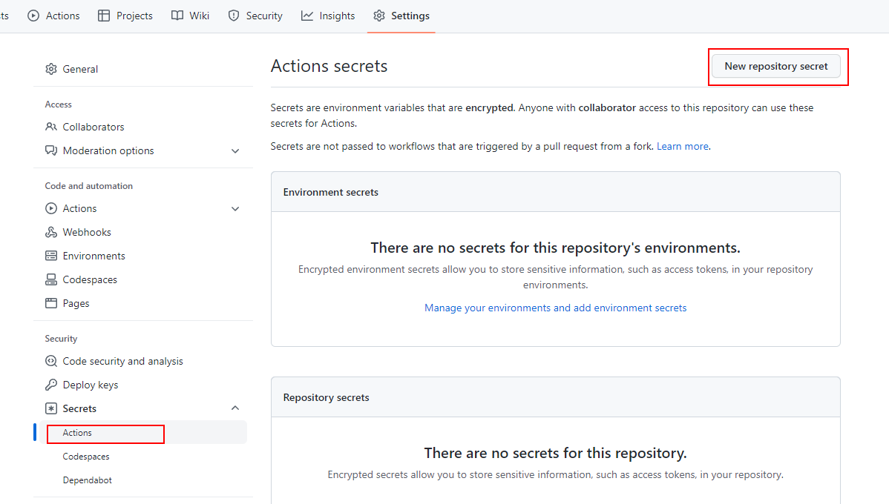
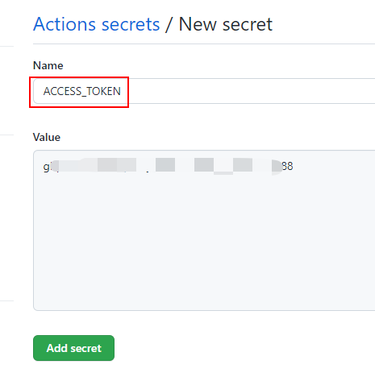
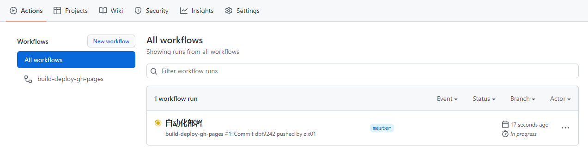
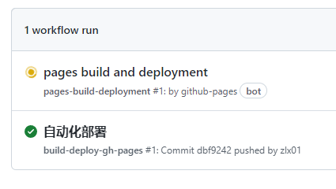

# vue2-gh-pages-deploy

0. 项目部署在网站非根目录下，需要修改 `vue.config.js`

   ```js
   module.exports = {
     publicPath:
       process.env.NODE_ENV === "production" ? "/vue2-deploy-gh-pages/" : "/",
   };
   ```

1. 新建 [deploy-to-gh-pages.yml](./.github/workflows/deploy-to-gh-pages.yml)

2. 创建 [Personal AccessToken](https://github.com/settings/tokens/new)

   

   

3. 在仓库 `vue2-deploy-gh-pages` 中添加secret

   

   

4. 观察工作流。打包后上传到gh-pages分支，会触发GitHub Pages自动化部署。

   

   

5. 访问网页：https://zlx01.github.io/vue2-deploy-gh-pages/

---

## Project setup
```
npm install
```

### Compiles and hot-reloads for development
```
npm run serve
```

### Compiles and minifies for production
```
npm run build
```

### Lints and fixes files
```
npm run lint
```

### Customize configuration
See [Configuration Reference](https://cli.vuejs.org/config/).
